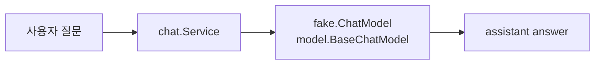
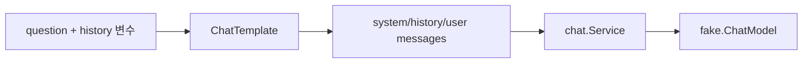
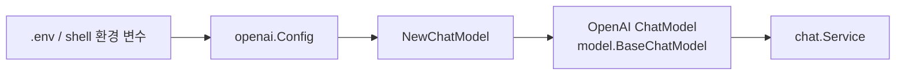
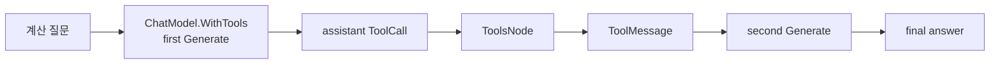
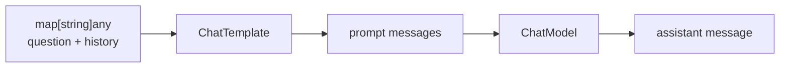
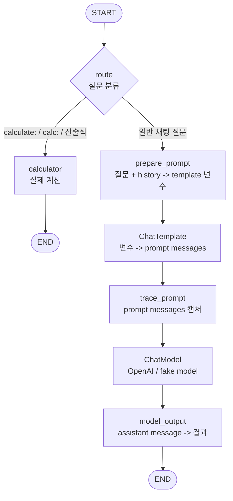
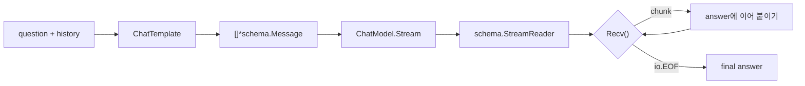
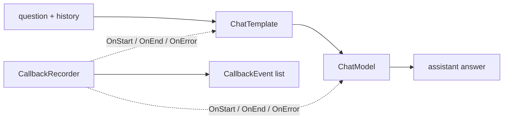
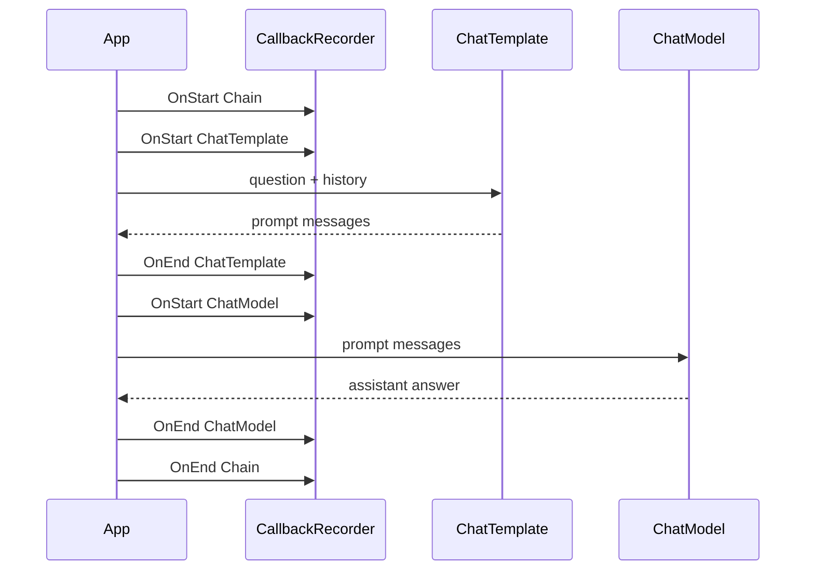
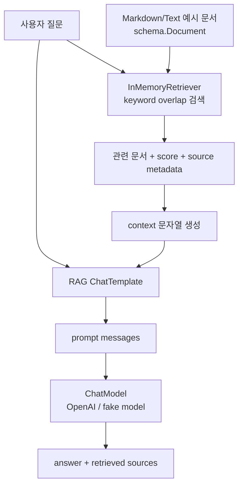

# eino-learning

Go와 CloudWeGo Eino를 단계별로 익히는 학습 저장소입니다. 처음에는 외부 LLM API 없이 fake 기반 예제로 구조와 테스트 방법을 먼저 익힙니다.

## Chapter 01. ChatModel

이번 장의 목표:

- Eino의 `ChatModel` 역할을 이해합니다.
- fake ChatModel을 만들어 외부 API 없이 테스트합니다.
- 이후 OpenAI 모델로 교체 가능한 service 경계를 만듭니다.

핵심 개념:

- `internal/fake`는 테스트용 fake model을 제공합니다.
- `internal/llm/chat`은 `model.BaseChatModel`을 받아 질문/응답 흐름을 실행합니다.
- `cmd/ch01-chatmodel`은 fake model을 사용하는 최소 실행 예제입니다.

흐름:



실행 명령:

```bash
go run ./cmd/ch01-chatmodel "What is Eino?"
```

한국어 예시 질문:

```bash
go run ./cmd/ch01-chatmodel "Eino는 어떤 문제를 해결하나요?"
```

출력에서 확인할 것:

- fake model이 항상 같은 답변을 반환하므로 외부 API 없이도 service 흐름을 검증할 수 있습니다.
- `chat.Service`는 concrete fake type이 아니라 `model.BaseChatModel` interface에만 의존합니다.

테스트 명령:

```bash
go test ./...
```

다음 장에서 할 일:

- Chapter 02에서 system/user/assistant message와 prompt template을 구조화합니다.
- OpenAI 실제 연동은 Chapter 03에서 `RUN_EINO_INTEGRATION=1` 기반 integration test로 분리합니다.

## Chapter 02. Prompt Template과 Message 설계

이번 장의 목표:

- Eino의 `prompt.ChatTemplate`이 변수를 `[]*schema.Message`로 바꾸는 흐름을 이해합니다.
- system prompt, optional chat history, user question 순서의 message 설계를 테스트합니다.
- `chat.Service`가 template으로 만든 message를 `ChatModel.Generate`에 전달하게 만듭니다.

핵심 개념:

- `prompt.FromMessages(schema.FString, ...)`는 message template 목록을 만듭니다.
- `schema.MessagesPlaceholder("history", true)`는 history가 없을 때 빈 message 목록으로 처리합니다.
- fake model의 `LastInput`으로 실제 모델에 들어간 role/content 순서를 검증합니다.

흐름:



실행 명령:

```bash
go run ./cmd/ch02-prompt-template 'How does ChatTemplate work?'
```

한국어 예시 질문:

```bash
go run ./cmd/ch02-prompt-template 'Prompt Template은 어떤 메시지를 만드나요?'
```

출력에서 확인할 것:

- `messages sent to model`에 system, history, user message가 순서대로 출력됩니다.
- history가 먼저 들어가고 마지막 user message가 현재 질문이 되는 구조를 확인합니다.

테스트 명령:

```bash
go test ./...
```

다음 장에서 할 일:

- Chapter 03에서 OpenAI ChatModel을 `RUN_EINO_INTEGRATION=1` 기반 opt-in integration test로 연동합니다.

## Chapter 03. OpenAI ChatModel 연동

이번 장의 목표:

- Eino extension의 OpenAI ChatModel을 `chat.Service`에 주입합니다.
- `.env` 또는 환경 변수의 `OPENAI_API_KEY`, `OPENAI_MODEL`, `OPENAI_BASE_URL`로 provider 설정을 분리합니다.
- 실제 API 호출은 `RUN_EINO_INTEGRATION=1`일 때만 실행되게 만듭니다.

핵심 개념:

- `internal/llm/chat`과 `internal/llm/openai`는 `model.BaseChatModel` 경계로 연결됩니다.
- 기본 모델명은 `.env.example`과 같은 `gpt-4.1-mini`입니다.
- 설정 우선순위는 shell 환경 변수, repo root `.env`, 코드 기본값 순서입니다.
- unit test는 API를 호출하지 않고, integration test만 opt-in으로 실제 OpenAI API를 호출합니다.

흐름:



`.env` 예시:

```env
OPENAI_API_KEY=your-api-key
OPENAI_MODEL=gpt-4.1-mini
OPENAI_BASE_URL=
RUN_EINO_INTEGRATION=1
```

기본 실행 명령:

```bash
go run ./cmd/ch03-openai-chatmodel 'What does Eino ChatModel do?'
```

한국어 예시 질문:

```bash
go run ./cmd/ch03-openai-chatmodel 'Eino ChatModel은 어떤 역할인가요?'
```

출력에서 확인할 것:

- `RUN_EINO_INTEGRATION=1`이 없으면 실제 API를 호출하지 않고 설정 안내만 출력합니다.
- integration을 켜면 Chapter 01의 `chat.Service`가 fake 대신 OpenAI ChatModel을 사용합니다.

integration test:

```bash
go test ./internal/llm/openai -run TestOpenAIChatModelIntegration -count=1 -v
```

외부 API 없이 전체 테스트:

```bash
RUN_EINO_INTEGRATION=0 go test ./...
```

## Chapter 04. Tool Calling

이번 장의 목표:

- Eino의 `tool.InvokableTool`과 `schema.ToolInfo` 역할을 이해합니다.
- `ChatModel.WithTools`로 model에 tool schema를 전달합니다.
- model이 생성한 `ToolCall`을 Eino `ToolsNode`로 실행해 `ToolMessage`를 만듭니다.
- tool 결과를 message history에 붙여 model에게 최종 답변을 다시 요청합니다.

핵심 개념:

- tool은 model에게 보여줄 metadata(`Info`)와 실제 실행 함수(`InvokableRun`)를 함께 가집니다.
- 이번 장의 `calculator` tool은 `+`, `-`, `*`, `/`, 괄호만 지원하는 안전한 실제 계산 tool입니다.
- `schema.ToolCall`은 assistant가 요청한 함수 호출이고, `schema.ToolMessage`는 tool 실행 결과입니다.
- Chapter 4 CLI는 `OPENAI_API_KEY`가 있으면 실제 OpenAI ChatModel로 tool calling loop를 실행합니다.
- 초반 chapter에서는 shell, 파일 삭제, 배포 같은 위험 tool을 등록하지 않습니다.

흐름:



실행 명령:

이 예시는 model-backed tool calling을 실행하므로 `OPENAI_API_KEY`가 필요합니다. API key 없이 흐름을 확인할 때는 아래 테스트 명령을 사용합니다.

```bash
go run ./cmd/ch04-tool-calling '12 * (7 + 3)'
```

한국어 예시 질문:

```bash
go run ./cmd/ch04-tool-calling '15 * (2 + 6)'
```

출력에서 확인할 것:

- `model tool calls`에서 model이 어떤 tool name과 arguments를 요청했는지 봅니다.
- `tool messages`에서 calculator 실행 결과가 `ToolMessage`로 다시 model에게 전달되는지 봅니다.
- `final answer`는 tool result를 받은 뒤 생성된 두 번째 model 응답입니다.

`OPENAI_API_KEY`는 shell 환경 변수 또는 repository root의 `.env`에서 읽습니다.

테스트 명령:

```bash
RUN_EINO_INTEGRATION=0 go test ./internal/llm/toolcalling ./internal/tools
```

실제 OpenAI tool calling integration test:

```bash
RUN_EINO_INTEGRATION=1 go test ./internal/llm/toolcalling -run TestOpenAIToolCallingIntegration -count=1 -v
```

다음 장에서 할 일:

- Chapter 05에서 ChatTemplate과 ChatModel을 Eino Chain으로 연결합니다.

## Chapter 05. Chain 구성

이번 장의 목표:

- Eino의 `compose.NewChain`으로 선형 component pipeline을 구성합니다.
- 기존 `ChatTemplate -> ChatModel` 흐름을 직접 호출 대신 compiled `Runnable`로 실행합니다.
- unit test는 fake model로 검증하고, CLI와 integration test는 실제 OpenAI ChatModel로 실행합니다.

핵심 개념:

- Chain은 component를 `Append...` 순서대로 연결한 뒤 `Compile`해서 `Runnable`로 만듭니다.
- 이번 장의 Chain은 `map[string]any -> ChatTemplate -> ChatModel -> *schema.Message` 흐름입니다.
- `Runnable.Invoke(ctx, input)`은 Chain 전체를 하나의 함수처럼 실행합니다.
- Chapter 5 CLI는 `OPENAI_API_KEY`가 있으면 실제 OpenAI ChatModel을 Chain에 연결합니다.
- CLI는 trace lambda를 통해 input variables, ChatTemplate output, ChatModel output을 단계별로 출력합니다.
- tool calling처럼 반복이나 조건이 필요한 흐름은 이후 Graph/Agent 장에서 더 자연스럽게 다룹니다.

흐름:



실행 명령:

이 예시는 OpenAI ChatModel을 Chain에 연결하므로 `OPENAI_API_KEY`가 필요합니다. API key 없이 흐름을 확인할 때는 아래 테스트 명령을 사용합니다.

```bash
go run ./cmd/ch05-chain 'How does Chain work?'
```

한국어 예시 질문:

```bash
go run ./cmd/ch05-chain 'Chain은 Prompt Template과 ChatModel을 어떻게 연결하나요?'
```

출력에서 확인할 것:

- `1. input variables`에서 Chain에 들어간 raw input을 확인합니다.
- `2. ChatTemplate output messages`에서 template node의 출력을 확인합니다.
- `3. ChatModel output`에서 마지막 component가 만든 assistant message를 확인합니다.

`OPENAI_API_KEY`는 shell 환경 변수 또는 repository root의 `.env`에서 읽습니다.

테스트 명령:

```bash
go test ./internal/llm/chain -run 'TestService|TestNewService' -count=1
```

실제 OpenAI Chain integration test:

```bash
RUN_EINO_INTEGRATION=1 go test ./internal/llm/chain -run TestOpenAIChatChainIntegration -count=1 -v
```

다음 장에서 할 일:

- Chapter 06에서 Graph로 분기와 더 복잡한 실행 흐름을 다룹니다.

## Chapter 06. Graph 구성

이번 장의 목표:

- Eino의 `compose.NewGraph`로 명시적인 node와 edge를 가진 DAG를 구성합니다.
- `AddBranch`로 입력에 따라 calculator branch 또는 chat model branch를 선택합니다.
- Chain보다 Graph가 어울리는 분기 흐름을 실제 실행 출력으로 확인합니다.

핵심 개념:

- Graph는 `START`, named node, `END`를 edge로 직접 연결합니다.
- 이번 장의 Graph는 `route` node에서 질문을 분류합니다.
- `calculate:` 또는 `calc:` 질문은 `calculator` branch에서 실제 계산하고 model을 호출하지 않습니다.
- 일반 질문은 `prepare_prompt -> ChatTemplate -> ChatModel` branch로 이동합니다.
- CLI는 선택된 route, branch별 중간 출력, final answer를 보여줍니다.

Graph 다이어그램:



Node 주석:

- `route`: 질문을 보고 계산 branch 또는 채팅 branch를 선택합니다.
- `calculator`: `internal/tools.Calculate`를 직접 호출하므로 ChatModel을 호출하지 않습니다.
- `prepare_prompt`: Graph 내부 state를 `ChatTemplate` 입력 변수로 바꿉니다.
- `ChatTemplate`: system, history, user question 메시지 목록을 만듭니다.
- `trace_prompt`: CLI와 테스트에서 prompt message를 관찰하기 위한 추적 node입니다.
- `ChatModel`: 일반 질문 branch에서만 실제 model을 호출합니다.
- `model_output`: model response를 `graph.Result`로 포장합니다.

실행 명령:

이 CLI는 OpenAI ChatModel을 구성한 뒤 Graph를 실행하므로 `OPENAI_API_KEY`가 필요합니다. calculator branch는 선택된 뒤에는 ChatModel을 호출하지 않지만, CLI 시작 시점의 config 검증은 통과해야 합니다. API key 없이 흐름을 확인할 때는 아래 테스트 명령을 사용합니다.

```bash
go run ./cmd/ch06-graph
```

단일 질문 실행:

```bash
go run ./cmd/ch06-graph 'calculate: 7 * (8 + 2)'
```

한국어 예시 질문:

```bash
go run ./cmd/ch06-graph 'calculate: 9 * (3 + 4)'
go run ./cmd/ch06-graph 'Graph는 Chain과 언제 다르게 쓰나요?'
```

출력에서 확인할 것:

- `selected route: calculator`이면 ChatModel 없이 calculator branch에서 종료됩니다.
- `selected route: chat`이면 `ChatTemplate output messages`와 `ChatModel output`을 차례대로 확인합니다.
- 같은 Graph 안에서 deterministic tool path와 model-backed chat path가 분리됩니다.

`OPENAI_API_KEY`는 shell 환경 변수 또는 repository root의 `.env`에서 읽습니다.

테스트 명령:

```bash
go test ./internal/llm/graph -run 'TestAssistantGraph|TestNewService' -count=1
```

실제 OpenAI Graph integration test:

```bash
RUN_EINO_INTEGRATION=1 go test ./internal/llm/graph -run TestOpenAIAssistantGraphIntegration -count=1 -v
```

다음 장에서 할 일:

- Chapter 07에서 Streaming을 다룹니다.

## Chapter 07. Streaming

이번 장의 목표:

- `ChatModel.Stream`이 `schema.StreamReader[*schema.Message]`를 반환하는 흐름을 이해합니다.
- `Recv()`를 `io.EOF`까지 반복하며 chunk를 받아 최종 answer로 합칩니다.
- unit test는 fake streaming model로 검증하고, CLI와 integration test는 실제 OpenAI ChatModel로 실행합니다.

핵심 개념:

- Streaming은 `Generate`처럼 완성된 assistant message를 기다리지 않고, 생성되는 조각을 순서대로 읽습니다.
- `StreamReader`는 한 번만 읽을 수 있고, 사용 후 `Close()`해야 합니다.
- 이번 장의 흐름은 `question + history -> ChatTemplate -> ChatModel.Stream -> StreamReader.Recv loop`입니다.
- `streaming.Service.AskWithHistory`는 stream chunk를 모아 `streaming.Result`로 반환합니다.
- `streaming.Service.StreamWithHistory`는 CLI처럼 직접 `Recv()` loop를 제어하고 싶을 때 사용합니다.

Streaming 다이어그램:



실행 명령:

이 예시는 OpenAI ChatModel streaming을 실행하므로 `OPENAI_API_KEY`가 필요합니다. API key 없이 흐름을 확인할 때는 아래 테스트 명령을 사용합니다.

```bash
go run ./cmd/ch07-streaming 'How does Eino streaming work?'
```

한국어 예시 질문:

```bash
go run ./cmd/ch07-streaming 'Streaming은 Generate와 무엇이 다른가요?'
```

출력에서 확인할 것:

- `stream chunks`는 model 응답이 완성되기 전에 도착하는 content 조각입니다.
- `received chunks`는 `Recv()` loop가 실제로 몇 번 content를 받은 것인지 보여줍니다.
- `final answer`는 chunk를 순서대로 이어 붙인 결과입니다.

`OPENAI_API_KEY`는 shell 환경 변수 또는 repository root의 `.env`에서 읽습니다.

테스트 명령:

```bash
go test ./internal/llm/streaming -run 'TestChatService.*|TestCollectMessageStream' -count=1
go test ./internal/fake -run TestStreamingChatModel -count=1
```

실제 OpenAI Streaming integration test:

```bash
RUN_EINO_INTEGRATION=1 go test ./internal/llm/streaming -run TestOpenAIChatStreamingIntegration -count=1 -v
```

다음 장에서 할 일:

- Chapter 08에서 Callback과 Observability를 다룹니다.

## Chapter 08. Callback과 Observability

이번 장의 목표:

- Eino `callbacks.NewHandlerBuilder`로 component lifecycle event를 관찰합니다.
- `compose.WithCallbacks(handler)`로 한 번의 Chain 실행에 callback handler를 연결합니다.
- `ChatTemplate -> ChatModel` 흐름에서 start/end/error event를 수집해 출력합니다.

핵심 개념:

- Callback은 component 실행 전후와 error 시점에 호출되는 관찰 hook입니다.
- `callbacks.RunInfo`는 callback을 발생시킨 node 이름과 component 종류를 알려줍니다.
- callback input/output은 component별 타입으로 변환해서 읽습니다.
- 이번 장은 `prompt.ConvCallbackInput`, `prompt.ConvCallbackOutput`, `model.ConvCallbackInput`, `model.ConvCallbackOutput`를 사용합니다.
- Unit test는 fake model로 event를 검증하고, CLI와 integration test는 실제 OpenAI ChatModel로 실행합니다.

Callback 다이어그램:



실선은 실제 답변 생성 흐름이고, 점선은 관찰 흐름입니다. Callback은 답변을 대신 만들지 않고 옆에서 start/end/error event를 기록합니다.



테스트에서는 위 순서가 `Chain start -> ChatTemplate start/end -> ChatModel start/end -> Chain end`로 기록되는지 확인합니다. 이 검증 덕분에 callback이 주 실행 흐름을 바꾸는 기능이 아니라 실행 과정을 관찰하는 기능이라는 점을 코드로도 확인할 수 있습니다.

실행 명령:

이 예시는 OpenAI ChatModel 실행에 callback을 붙이므로 `OPENAI_API_KEY`가 필요합니다. API key 없이 흐름을 확인할 때는 아래 테스트 명령을 사용합니다.

```bash
go run ./cmd/ch08-callback-observability 'Eino callback은 observability에 어떻게 도움이 되나요?'
```

한국어 예시 질문:

```bash
go run ./cmd/ch08-callback-observability 'ChatTemplate과 ChatModel 실행을 callback으로 어떻게 관찰하나요?'
```

출력에서 확인할 것:

- `callback events`는 Chain, ChatTemplate, ChatModel의 start/end event를 시간 순서로 보여줍니다.
- 각 event의 `summary`에서 prompt 변수, prompt message 수, model output 요약을 확인합니다.
- callback은 답변을 바꾸는 기능이 아니라 실행 흐름을 관찰하는 기능입니다.

`OPENAI_API_KEY`는 shell 환경 변수 또는 repository root의 `.env`에서 읽습니다.

테스트 명령:

```bash
go test ./internal/llm/observability -run 'TestRunObservableChatChain' -count=1
```

실제 OpenAI Callback integration test:

```bash
RUN_EINO_INTEGRATION=1 go test ./internal/llm/observability -run TestOpenAIObservableChatChainIntegration -count=1 -v
```

다음 장에서 할 일:

- Chapter 09에서 RAG 기초를 다룹니다.

## Chapter 09. RAG 기초

이번 장의 목표:

- Eino `Retriever`가 질문에 맞는 `schema.Document`를 반환하는 흐름을 이해합니다.
- Markdown/Text 예시 문서를 in-memory keyword retriever로 검색합니다.
- 검색된 문서 context를 prompt에 넣고 ChatModel 답변과 sources를 함께 출력합니다.
- RAG v1 범위를 작게 유지해 retrieval, prompt grounding, source 표시의 기본 구조에 집중합니다.

핵심 개념:

- RAG 흐름은 `question -> Retriever -> context prompt -> ChatModel -> answer + sources`입니다.
- `cmd/ch09-rag`는 `testdata/docs/ch09-rag`의 `.md`, `.txt` 파일을 읽어 `schema.Document`로 바꿉니다.
- 문서 title/source metadata는 최종 출력의 retrieved sources와 prompt context summary에 사용합니다.
- v1에서는 PDF parser, embedding provider, vector store를 사용하지 않습니다. 이런 기능은 후속 chapter 또는 확장 과제로 남깁니다.

RAG 흐름 그래프:



실행 명령:

이 예시는 OpenAI ChatModel 기반 RAG를 실행하므로 `OPENAI_API_KEY`가 필요합니다. API key 없이 retrieval과 prompt 구성 흐름을 확인할 때는 아래 테스트 명령을 사용합니다.

```bash
go run ./cmd/ch09-rag 'Chapter 8 callback은 RAG에서 어떤 흐름을 관찰하나요?'
```

한국어 예시 질문:

```bash
go run ./cmd/ch09-rag 'RAG는 검색된 문서를 어떻게 답변 근거로 사용하나요?'
```

출력에서 확인할 것:

- `retrieved sources`에서 어떤 문서가 검색됐는지 title/source/score를 먼저 확인합니다.
- `prompt context summary`에서 검색된 문서가 prompt context로 들어갔는지 확인합니다.
- `final answer`가 source-grounded context 안에서 답하도록 유도되는 흐름을 확인합니다.

`OPENAI_API_KEY`는 shell 환경 변수 또는 repository root의 `.env`에서 읽습니다.

테스트 명령:

```bash
go test ./cmd/ch09-rag ./internal/llm/rag -count=1
RUN_EINO_INTEGRATION=0 go test ./...
```

실제 OpenAI RAG integration test:

```bash
RUN_EINO_INTEGRATION=1 go test ./internal/llm/rag -run TestOpenAIRAGIntegration -count=1 -v
```

다음 장에서 할 일:

- Chapter 10에서 ReAct Agent를 다룹니다.
