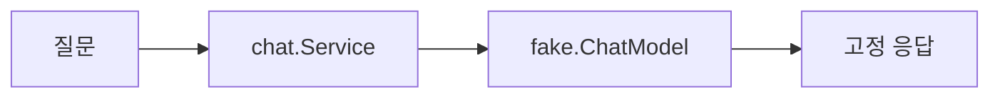
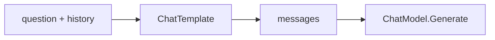
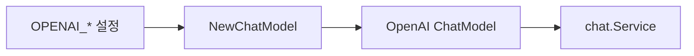
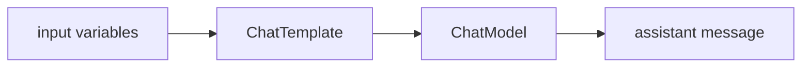
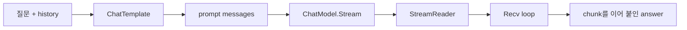
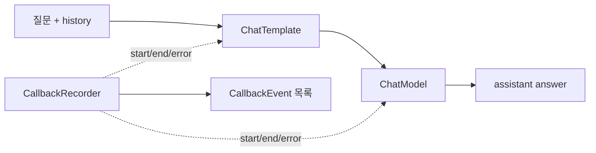
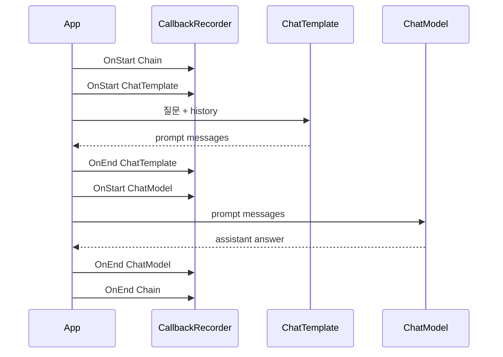
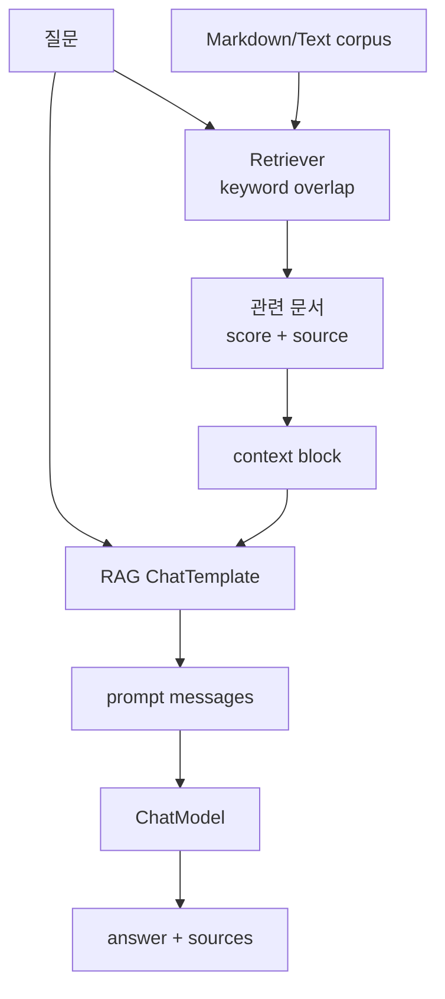
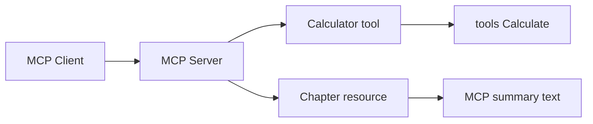
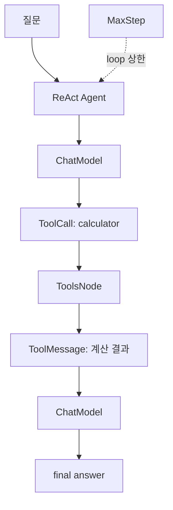

# Notes

이 문서는 chapter별 개념 설명과 흐름 그래프를 모아둔 학습 노트입니다. 실행 명령과 완료 상태는 [progress.md](progress.md)를, 목표와 완료 기준은 [../guides/chapters.md](../guides/chapters.md)를 봅니다.

## Chapter 01

- fake ChatModel은 외부 API 없이 Eino의 `ChatModel` 형태를 이해하기 위한 학습용 구현입니다.
- `chat.Service`는 `model.BaseChatModel`에만 의존하므로 나중에 OpenAI ChatModel로 교체할 수 있습니다.
- 실행 예시는 `go run ./cmd/ch01-chatmodel "Eino는 어떤 문제를 해결하나요?"`처럼 질문을 CLI argument로 전달합니다.
- 출력은 fake 응답 하나뿐이지만, 이 단순함 덕분에 service가 model interface를 호출하는 최소 구조를 먼저 확인할 수 있습니다.
- `OPENAI_API_KEY`는 Chapter 03 integration test에서만 사용합니다.



## Chapter 02

- `prompt.ChatTemplate`은 변수 map을 받아 `[]*schema.Message`를 생성합니다.
- 이번 장의 기본 template은 system prompt, optional history, user question 순서로 메시지를 만듭니다.
- `schema.MessagesPlaceholder("history", true)`를 사용하면 history가 없을 때도 같은 template을 재사용할 수 있습니다.
- `chat.Service`는 template이 만든 메시지 목록을 `ChatModel.Generate`에 전달합니다.
- 실행 예시는 `go run ./cmd/ch02-prompt-template 'Prompt Template은 어떤 메시지를 만드나요?'`입니다.
- 출력의 `messages sent to model`은 template 결과를 직접 보여주므로 role 순서와 현재 질문 위치를 확인하기 좋습니다.



## Chapter 03

- OpenAI provider는 `github.com/cloudwego/eino-ext/components/model/openai`의 `NewChatModel`로 생성합니다.
- `chat.Service`는 provider 종류를 모르고 `model.BaseChatModel`만 사용하므로 fake model과 OpenAI model을 같은 경계로 다룰 수 있습니다.
- `RUN_EINO_INTEGRATION=1`이 없으면 실제 OpenAI API 호출 test와 CLI 실행은 건너뜁니다.
- `.env`는 repo root에서 자동으로 읽으며, shell 환경 변수가 있으면 `.env`보다 우선합니다.
- API key는 `OPENAI_API_KEY` 환경 변수에서 읽고 코드, 테스트, fixture에 저장하지 않습니다.
- 실행 예시는 `go run ./cmd/ch03-openai-chatmodel 'Eino ChatModel은 어떤 역할인가요?'`입니다.
- `RUN_EINO_INTEGRATION=1`이 없으면 설정 안내만 출력되므로, 학습자는 실제 과금 호출 전에 설정 gate를 확인할 수 있습니다.



## Chapter 04

- Eino tool은 model에 제공할 `schema.ToolInfo`와 실행 함수인 `InvokableRun`을 함께 가집니다.
- `model.ToolCallingChatModel.WithTools`는 tool schema가 붙은 새 model instance를 반환합니다.
- Chapter 4의 전체 흐름은 `WithTools` -> first `Generate` -> `ToolCalls` -> `ToolsNode` -> `ToolMessages` -> second `Generate`입니다.
- `schema.ToolCall`은 assistant message에 들어가는 실행 요청이고, `schema.ToolMessage`는 tool 실행 결과입니다.
- 이번 장의 `calculator` tool은 문자열을 실행하지 않고 Go expression AST를 평가해 실제 산술 계산을 수행합니다.
- `calculator`는 `+`, `-`, `*`, `/`, 괄호, unary `+/-`만 허용하고 함수 호출, identifier, division by zero는 error로 거부합니다.
- `compose.ToolsNode`는 assistant message 안의 tool call을 실행하고 tool call id가 연결된 tool message 목록을 반환합니다.
- 실행 예시는 `go run ./cmd/ch04-tool-calling '15 * (2 + 6)'`이며, model-backed tool calling이라 `OPENAI_API_KEY`가 필요합니다.
- API key 없이 흐름을 확인할 때는 `RUN_EINO_INTEGRATION=0 go test ./internal/llm/toolcalling ./internal/tools`를 사용합니다.
- 출력은 `model tool calls` -> `tool messages` -> `final answer` 순서라서 model 요청, tool 실행, 최종 응답의 두 번 Generate 흐름을 분리해서 볼 수 있습니다.
- Unit test는 scripted fake tool-calling model을 사용하고, 실제 OpenAI 호출은 `RUN_EINO_INTEGRATION=1`일 때만 실행합니다.

```mermaid
flowchart LR
    model1["first Generate"] --> call["ToolCall"]
    call --> tool["ToolsNode"]
    tool --> msg["ToolMessage"]
    msg --> model2["second Generate"]
```

## Chapter 05

- `compose.NewChain[I, O]`는 입력 타입과 출력 타입을 가진 선형 pipeline builder입니다.
- `AppendChatTemplate`은 `map[string]any` 입력을 `[]*schema.Message`로 바꾸고, `AppendChatModel`은 그 메시지를 model에 전달해 `*schema.Message`를 만듭니다.
- Chain은 `Compile(ctx)` 이후 `Runnable`이 되며, `Invoke(ctx, input)`으로 전체 component 순서를 실행합니다.
- Chapter 5의 `chain.Service`는 기존 manual `chat.Service`와 같은 prompt/model 흐름을 Eino Chain으로 표현합니다.
- Chapter 5 CLI는 `.env` 또는 shell의 `OPENAI_API_KEY`로 실제 OpenAI ChatModel을 Chain에 연결합니다.
- `RunChatChainWithTrace`는 trace lambda를 Chain 중간에 넣어 input variables, prompt messages, model response를 관찰합니다.
- 실행 예시는 `go run ./cmd/ch05-chain 'Chain은 Prompt Template과 ChatModel을 어떻게 연결하나요?'`이며, OpenAI ChatModel을 연결하므로 `OPENAI_API_KEY`가 필요합니다.
- API key 없이 흐름을 확인할 때는 `go test ./internal/llm/chain -run 'TestService|TestNewService' -count=1`을 사용합니다.
- 출력의 `1. input variables`, `2. ChatTemplate output messages`, `3. ChatModel output`은 Chain 내부 node를 순서대로 따라가는 학습용 trace입니다.
- Unit test는 fake model로 빠르게 검증하고, 실제 OpenAI 호출은 `RUN_EINO_INTEGRATION=1`일 때만 실행합니다.
- 반복, 조건 분기, tool result를 다시 model에 넣는 흐름은 Chapter 6 Graph에서 더 명시적으로 다룰 예정입니다.



## Chapter 06

- `compose.NewGraph[I, O]`는 named node와 explicit edge로 실행 흐름을 구성합니다.
- `AddEdge(compose.START, "node")`와 `AddEdge("node", compose.END)`로 graph의 입구와 출구를 연결합니다.
- `compose.NewGraphBranch`와 `AddBranch`는 특정 node 출력값을 보고 다음 node를 선택합니다.
- Chapter 6 Graph는 `route` node에서 calculator 질문과 일반 chat 질문을 분기합니다.
- calculator branch는 `internal/tools.Calculate`를 직접 실행하므로 model을 호출하지 않습니다.
- chat branch는 `prepare_prompt -> ChatTemplate -> ChatModel`로 이어지며, Chain에서 배운 선형 흐름을 Graph의 한 branch로 표현합니다.
- CLI는 선택된 route와 branch별 중간 값을 출력해서 Graph가 실제로 어디로 흘렀는지 보여줍니다.
- 계산 branch 예시는 `go run ./cmd/ch06-graph 'calculate: 9 * (3 + 4)'`이며, CLI가 OpenAI ChatModel을 먼저 구성하므로 `OPENAI_API_KEY`가 필요합니다.
- calculator branch는 route 선택 뒤에는 model을 호출하지 않지만, CLI 시작 시점의 config 검증은 통과해야 합니다.
- 채팅 branch 예시는 `go run ./cmd/ch06-graph 'Graph는 Chain과 언제 다르게 쓰나요?'`입니다.
- API key 없이 흐름을 확인할 때는 `go test ./internal/llm/graph -run 'TestAssistantGraph|TestNewService' -count=1`을 사용합니다.
- 출력의 `selected route`가 calculator인지 chat인지 먼저 보고, branch별 중간 출력을 비교합니다.


## Chapter 07

- `ChatModel.Stream`은 완성된 `Generate` 응답 대신 `*schema.StreamReader[*schema.Message]`를 반환합니다.
- `StreamReader.Recv()`를 반복 호출하면 assistant message chunk가 순서대로 나오고, `io.EOF`가 나오면 stream이 끝난 것입니다.
- `StreamReader`는 한 번만 읽을 수 있으므로 여러 소비자가 필요하면 읽기 전에 `Copy`를 사용해야 합니다.
- stream을 다 읽었거나 중간에 중단하더라도 `Close()`를 호출해야 합니다.
- Chapter 7의 `streaming.Service.StreamWithHistory`는 `ChatTemplate`이 만든 prompt messages를 `ChatModel.Stream`에 전달합니다.
- `streaming.Service.AskWithHistory`는 CLI가 아닌 test나 service code에서 쓰기 편하도록 chunk를 모아 `streaming.Result.Answer`를 만듭니다.
- 실행 예시는 `go run ./cmd/ch07-streaming 'Streaming은 Generate와 무엇이 다른가요?'`이며, OpenAI ChatModel streaming이라 `OPENAI_API_KEY`가 필요합니다.
- API key 없이 흐름을 확인할 때는 `go test ./internal/llm/streaming -run 'TestChatService.*|TestCollectMessageStream' -count=1`을 사용합니다.
- 출력의 `stream chunks`는 실시간으로 찍히고, 마지막 `final answer`는 같은 chunk를 이어 붙인 결과입니다.
- Unit test는 `fake.StreamingChatModel`로 빠르게 검증하고, 실제 OpenAI 호출은 `RUN_EINO_INTEGRATION=1`일 때만 실행합니다.



## Chapter 08

- Eino callback은 component 실행 lifecycle을 관찰하는 hook입니다.
- `callbacks.NewHandlerBuilder`는 필요한 timing만 등록해 handler를 만듭니다.
- `compose.WithCallbacks(handler)`를 `Runnable.Invoke`에 넘기면 해당 실행에만 callback이 적용됩니다.
- `OnStart`는 component 실행 전 input을 받고, `OnEnd`는 성공 output을 받으며, `OnError`는 component가 error를 반환할 때 호출됩니다.
- `callbacks.RunInfo`에는 node 이름과 component 종류가 들어 있으므로 log, tracing, metrics label로 사용할 수 있습니다.
- callback input/output은 공통 `any` 형태이므로 `prompt.ConvCallbackInput`, `model.ConvCallbackOutput` 같은 helper로 안전하게 변환합니다.
- stream callback의 `StreamReader` copy는 반드시 닫아야 하지만, Chapter 8은 먼저 non-streaming Chain event에 집중합니다.
- Unit test는 fake model로 callback event를 검증하고, 실제 OpenAI 호출은 `RUN_EINO_INTEGRATION=1`일 때만 실행합니다.
- 한국어 예시 질문은 `Eino callback은 observability에 어떻게 도움이 되나요?`입니다.
- 예시 history는 `Chapter 7에서는 무엇을 다뤘나요?` -> `StreamReader를 사용한 streaming 흐름을 다뤘습니다.` 순서로 넣습니다.
- 실행 예시는 `go run ./cmd/ch08-callback-observability 'ChatTemplate과 ChatModel 실행을 callback으로 어떻게 관찰하나요?'`이며, OpenAI ChatModel 실행이라 `OPENAI_API_KEY`가 필요합니다.
- API key 없이 흐름을 확인할 때는 `go test ./internal/llm/observability -run 'TestRunObservableChatChain' -count=1`을 사용합니다.
- 출력의 `callback events`에서 Chain, ChatTemplate, ChatModel의 start/end event가 시간 순서로 기록되는지 확인합니다.



Callback을 시간 순서로 보면 다음과 같습니다.



- 실선 흐름은 `질문 -> ChatTemplate -> ChatModel -> 답변`입니다.
- callback은 점선처럼 옆에서 lifecycle event만 받는 관찰자입니다.
- `TestRunObservableChatChainCapturesPromptAndModelEvents`는 이 event timeline을 검증해 callback이 답변 생성 흐름을 바꾸지 않는다는 점을 보여줍니다.

## Chapter 09

- RAG는 model이 바로 답하지 않고 먼저 관련 문서를 검색한 뒤, 검색 context를 prompt에 넣어 답변하는 구조입니다.
- 이번 장은 `testdata/docs/ch09-rag`의 Markdown/Text 문서만 사용합니다.
- CLI는 문서의 첫 non-empty line을 title로, 파일 경로를 source metadata로 저장합니다.
- 출력은 retrieved sources, prompt context summary, final answer 순서로 구성해 답변이 어떤 문서에 근거했는지 먼저 확인하게 합니다.
- v1은 in-memory keyword retriever만 사용합니다. PDF parser, embedding provider, vector store는 의도적으로 제외합니다.
- `OPENAI_API_KEY`가 없으면 기존 model-backed CLI처럼 설정 안내 후 종료합니다.
- Unit test는 외부 API 없이 CLI formatting과 RAG service를 검증하고, 실제 OpenAI 호출은 `RUN_EINO_INTEGRATION=1`일 때만 실행합니다.
- 실행 예시는 `go run ./cmd/ch09-rag 'RAG는 검색된 문서를 어떻게 답변 근거로 사용하나요?'`이며, OpenAI ChatModel 기반 RAG라 `OPENAI_API_KEY`가 필요합니다.
- API key 없이 흐름을 확인할 때는 `go test ./cmd/ch09-rag ./internal/llm/rag -count=1`을 사용합니다.
- 출력은 `retrieved sources`를 먼저 보여주므로 final answer를 읽기 전에 어떤 문서가 근거로 들어갔는지 확인할 수 있습니다.



이 그래프에서 `Retriever`는 답변을 생성하지 않습니다. 검색된 문서를 `context block`으로 바꾸고, `ChatTemplate`이 질문과 context를 함께 model 입력으로 만드는 것이 Chapter 09의 핵심입니다.

## Chapter 10

- MCP는 LLM host/client가 server의 tools, resources, prompts를 표준 protocol로 발견하고 호출하게 해 줍니다.
- 이번 장의 server는 local stdio transport를 사용하므로 일반 CLI 출력 프로그램이 아니라 MCP client가 stdin/stdout으로 연결하는 process입니다.
- `mcp.AddTool`은 typed Go handler를 받아 input schema와 structured output을 자동으로 구성합니다.
- 기존 `tools.Calculate`를 재사용하지만, MCP SDK의 JSON schema 추론과 충돌하지 않도록 MCP 전용 input type을 얇게 둡니다.
- `server.AddResource`는 `eino-learning://chapters/mcp` URI의 읽기 전용 학습 context를 제공합니다.
- `cmd/ch10-mcp-client`는 `mcp.CommandTransport`로 `cmd/ch10-mcp-server`를 subprocess로 실행해 tool call과 resource read를 눈으로 확인하는 예시입니다.
- Unit test는 `mcp.NewInMemoryTransports`로 실제 stdio 없이 MCP client/server session을 검증합니다.



## Chapter 11

- ReAct Agent는 model이 tool call을 요청하면 tool을 실행하고, 그 tool result를 다시 model 입력에 넣는 loop를 agent가 대신 관리하는 구조입니다.
- 이번 장은 `github.com/cloudwego/eino/flow/agent/react`의 `react.NewAgent`를 사용합니다.
- `react.AgentConfig`의 핵심 입력은 tool call이 가능한 `ToolCallingModel`, 실제 tool 구현을 담은 `ToolsConfig`, loop 상한인 `MaxStep`입니다.
- Chapter 04에서는 first `Generate`, `ToolsNode`, second `Generate`를 service가 직접 연결했습니다. Chapter 11에서는 같은 calculator tool을 ReAct Agent에 등록해 반복 흐름을 agent 내부 graph에 맡깁니다.
- `MaxStep`은 agent가 무한히 tool call을 반복하지 않도록 막는 안전장치입니다. 이 저장소의 기본값은 Eino ReAct Agent의 기본 의도에 맞춰 `12`로 둡니다.
- 실행 예시는 `go run ./cmd/ch11-react-agent '12 * (3 + 4)를 계산하고 풀이를 설명해 주세요'`이며, OpenAI ChatModel 기반 ReAct Agent라 `OPENAI_API_KEY`가 필요합니다.
- API key 없이 흐름을 확인할 때는 `go test ./cmd/ch11-react-agent ./internal/llm/agent -count=1`을 사용합니다.
- 출력의 `available tools`와 `max step`을 먼저 확인한 뒤, final answer가 calculator tool을 사용한 결과를 반영하는지 봅니다.



이 그래프에서 애플리케이션 코드는 `ChatModel -> ToolsNode -> ChatModel`을 직접 반복하지 않습니다. tool schema 등록, tool 실행, 다음 model 호출을 ReAct Agent가 graph로 관리하는 것이 Chapter 11의 핵심입니다.
