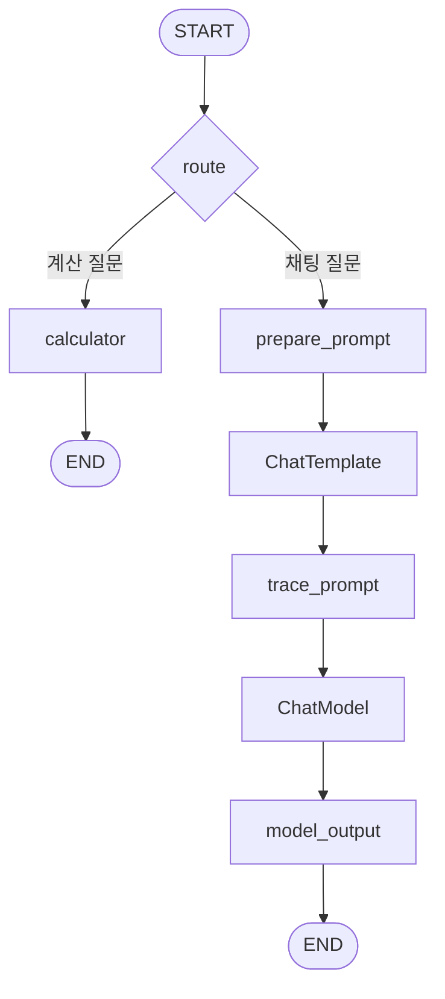
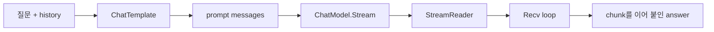
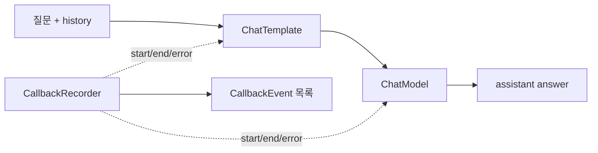
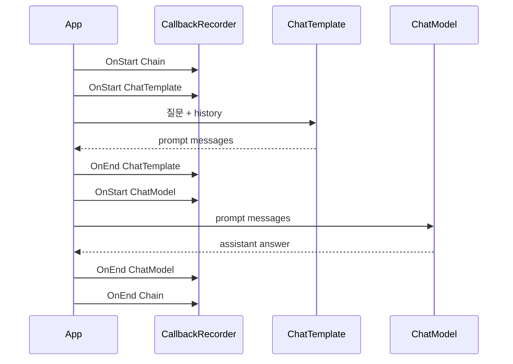

# Notes

## Chapter 01

- fake ChatModel은 외부 API 없이 Eino의 `ChatModel` 형태를 이해하기 위한 학습용 구현입니다.
- `chat.Service`는 `model.BaseChatModel`에만 의존하므로 나중에 OpenAI ChatModel로 교체할 수 있습니다.
- `OPENAI_API_KEY`는 Chapter 03 integration test에서만 사용합니다.

## Chapter 02

- `prompt.ChatTemplate`은 변수 map을 받아 `[]*schema.Message`를 생성합니다.
- 이번 장의 기본 template은 system prompt, optional history, user question 순서로 메시지를 만듭니다.
- `schema.MessagesPlaceholder("history", true)`를 사용하면 history가 없을 때도 같은 template을 재사용할 수 있습니다.
- `chat.Service`는 template이 만든 메시지 목록을 `ChatModel.Generate`에 전달합니다.

## Chapter 03

- OpenAI provider는 `github.com/cloudwego/eino-ext/components/model/openai`의 `NewChatModel`로 생성합니다.
- `chat.Service`는 provider 종류를 모르고 `model.BaseChatModel`만 사용하므로 fake model과 OpenAI model을 같은 경계로 다룰 수 있습니다.
- `RUN_EINO_INTEGRATION=1`이 없으면 실제 OpenAI API 호출 test와 CLI 실행은 건너뜁니다.
- `.env`는 repo root에서 자동으로 읽으며, shell 환경 변수가 있으면 `.env`보다 우선합니다.
- API key는 `OPENAI_API_KEY` 환경 변수에서 읽고 코드, 테스트, fixture에 저장하지 않습니다.

## Chapter 04

- Eino tool은 model에 제공할 `schema.ToolInfo`와 실행 함수인 `InvokableRun`을 함께 가집니다.
- `model.ToolCallingChatModel.WithTools`는 tool schema가 붙은 새 model instance를 반환합니다.
- Chapter 4의 전체 흐름은 `WithTools` -> first `Generate` -> `ToolCalls` -> `ToolsNode` -> `ToolMessages` -> second `Generate`입니다.
- `schema.ToolCall`은 assistant message에 들어가는 실행 요청이고, `schema.ToolMessage`는 tool 실행 결과입니다.
- 이번 장의 `calculator` tool은 문자열을 실행하지 않고 Go expression AST를 평가해 실제 산술 계산을 수행합니다.
- `calculator`는 `+`, `-`, `*`, `/`, 괄호, unary `+/-`만 허용하고 함수 호출, identifier, division by zero는 error로 거부합니다.
- `compose.ToolsNode`는 assistant message 안의 tool call을 실행하고 tool call id가 연결된 tool message 목록을 반환합니다.
- Unit test는 scripted fake tool-calling model을 사용하고, 실제 OpenAI 호출은 `RUN_EINO_INTEGRATION=1`일 때만 실행합니다.

## Chapter 05

- `compose.NewChain[I, O]`는 입력 타입과 출력 타입을 가진 선형 pipeline builder입니다.
- `AppendChatTemplate`은 `map[string]any` 입력을 `[]*schema.Message`로 바꾸고, `AppendChatModel`은 그 메시지를 model에 전달해 `*schema.Message`를 만듭니다.
- Chain은 `Compile(ctx)` 이후 `Runnable`이 되며, `Invoke(ctx, input)`으로 전체 component 순서를 실행합니다.
- Chapter 5의 `chain.Service`는 기존 manual `chat.Service`와 같은 prompt/model 흐름을 Eino Chain으로 표현합니다.
- Chapter 5 CLI는 `.env` 또는 shell의 `OPENAI_API_KEY`로 실제 OpenAI ChatModel을 Chain에 연결합니다.
- `RunChatChainWithTrace`는 trace lambda를 Chain 중간에 넣어 input variables, prompt messages, model response를 관찰합니다.
- Unit test는 fake model로 빠르게 검증하고, 실제 OpenAI 호출은 `RUN_EINO_INTEGRATION=1`일 때만 실행합니다.
- 반복, 조건 분기, tool result를 다시 model에 넣는 흐름은 Chapter 6 Graph에서 더 명시적으로 다룰 예정입니다.

## Chapter 06

- `compose.NewGraph[I, O]`는 named node와 explicit edge로 실행 흐름을 구성합니다.
- `AddEdge(compose.START, "node")`와 `AddEdge("node", compose.END)`로 graph의 입구와 출구를 연결합니다.
- `compose.NewGraphBranch`와 `AddBranch`는 특정 node 출력값을 보고 다음 node를 선택합니다.
- Chapter 6 Graph는 `route` node에서 calculator 질문과 일반 chat 질문을 분기합니다.
- calculator branch는 `internal/tools.Calculate`를 직접 실행하므로 model을 호출하지 않습니다.
- chat branch는 `prepare_prompt -> ChatTemplate -> ChatModel`로 이어지며, Chain에서 배운 선형 흐름을 Graph의 한 branch로 표현합니다.
- CLI는 선택된 route와 branch별 중간 값을 출력해서 Graph가 실제로 어디로 흘렀는지 보여줍니다.

## Chapter 07

- `ChatModel.Stream`은 완성된 `Generate` 응답 대신 `*schema.StreamReader[*schema.Message]`를 반환합니다.
- `StreamReader.Recv()`를 반복 호출하면 assistant message chunk가 순서대로 나오고, `io.EOF`가 나오면 stream이 끝난 것입니다.
- `StreamReader`는 한 번만 읽을 수 있으므로 여러 소비자가 필요하면 읽기 전에 `Copy`를 사용해야 합니다.
- stream을 다 읽었거나 중간에 중단하더라도 `Close()`를 호출해야 합니다.
- Chapter 7의 `streaming.Service.StreamWithHistory`는 `ChatTemplate`이 만든 prompt messages를 `ChatModel.Stream`에 전달합니다.
- `streaming.Service.AskWithHistory`는 CLI가 아닌 test나 service code에서 쓰기 편하도록 chunk를 모아 `streaming.Result.Answer`를 만듭니다.
- Unit test는 `fake.StreamingChatModel`로 빠르게 검증하고, 실제 OpenAI 호출은 `RUN_EINO_INTEGRATION=1`일 때만 실행합니다.

## Chapter 08

- Eino callback은 component 실행 lifecycle을 관찰하는 hook입니다.
- `callbacks.NewHandlerBuilder`는 필요한 timing만 등록해 handler를 만듭니다.
- `compose.WithCallbacks(handler)`를 `Runnable.Invoke`에 넘기면 해당 실행에만 callback이 적용됩니다.
- `OnStart`는 component 실행 전 input을 받고, `OnEnd`는 성공 output을 받으며, `OnError`는 component가 error를 반환할 때 호출됩니다.
- `callbacks.RunInfo`에는 node 이름과 component 종류가 들어 있으므로 log, tracing, metrics label로 사용할 수 있습니다.
- callback input/output은 공통 `any` 형태이므로 `prompt.ConvCallbackInput`, `model.ConvCallbackOutput` 같은 helper로 안전하게 변환합니다.
- stream callback의 `StreamReader` copy는 반드시 닫아야 하지만, Chapter 8은 먼저 non-streaming Chain event에 집중합니다.
- Unit test는 fake model로 callback event를 검증하고, 실제 OpenAI 호출은 `RUN_EINO_INTEGRATION=1`일 때만 실행합니다.
- 한국어 예시 질문은 `Eino callback은 observability에 어떻게 도움이 되나요?`입니다.
- 예시 history는 `Chapter 7에서는 무엇을 다뤘나요?` -> `StreamReader를 사용한 streaming 흐름을 다뤘습니다.` 순서로 넣습니다.

Callback을 시간 순서로 보면 다음과 같습니다.

- 실선 흐름은 `질문 -> ChatTemplate -> ChatModel -> 답변`입니다.
- callback은 점선처럼 옆에서 lifecycle event만 받는 관찰자입니다.
- `TestRunObservableChatChainCapturesPromptAndModelEvents`는 이 event timeline을 검증해 callback이 답변 생성 흐름을 바꾸지 않는다는 점을 보여줍니다.
